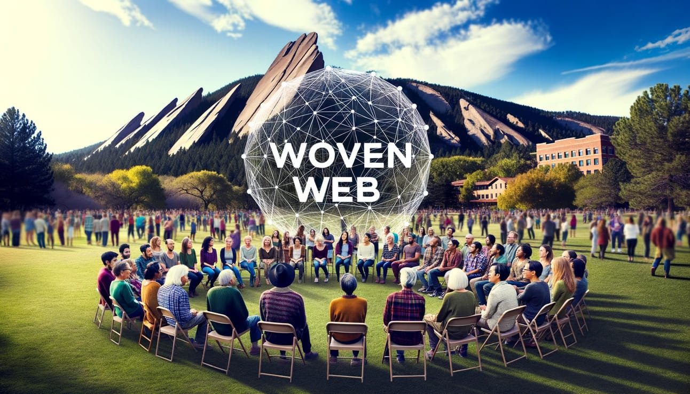

---
# Feel free to add content and custom Front Matter to this file.
# To modify the layout, see https://jekyllrb.com/docs/themes/#overriding-theme-defaults

layout: home
---

We exist within a vast interconnected web of life. Human society is a web within that web, and as humans we have developed technology that has become a web of it's own. In an ideal world, all of these mutually embedded webs are also mutually supportive, with technology contributing to the connectivity, health, and creativity of human society which in turn contributes to the well-being of our planetary web. Unfortunately, this is the ideal, not the actuality.

Woven Web exists to help address this distortion and support the balance of the web through fostering self-understanding and communication, and through participating in the emergence of a more connected culture in service to all life. When we talk about bringing systems to life, we are looking most directly at our technological systems and our social systems, not only enlivening these systems but bringing them into closer relationship with life and therefore helping them be more in service to the wider web.

Humans have an uncanny ability to cooperate which has enabled us to become so dominant as a species on this planet. What's needed now is to foster a sense of inclusion so that our ability to cooperate can be directed towards much more meaningful aims such as helping to bring about a world where we can all thrive. This requires us to understand and participate in our connectedness. Woven Web is seeking to bring people and organizations together to facilitate more mutual understanding and collaboration, and we are participating in the development of systems that support that. We recognize that while the problems we face are global and universal, change has to start local, and so we are deeply committed to participate in this change within our home here in Boulder Colorado.

What we're up to right now:

* Network Map: We are developing a network map starting with Boulder organizations, attempting to map out where meaningful action and engagement and connection is happening, to be able to foster more collaboration and participation towards what matters.
* Connectivity Tech: We are building technology to help foster more meaningful connection. Our first go at this is an app in development called Spontaneous which seeks to facilitate more spontaneous in person convergences.
* Facilitating Dialogue: We regularly facilitate dialogue in Boulder, often in partnership with other organizations, bringing people together to engage in the kinds of conversation that actually matter and build real connections in the process.

[Subscribe to our newsletter](https://wovenweb.beehiiv.com) to stay connected with us and the wider web we're weaving.
